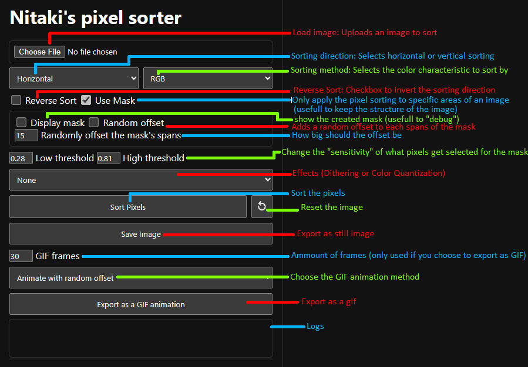

# Pixel sorting made easy
Insipired by [Acerola](https://github.com/GarrettGunnell/Pixel-Sorting)
 
You can try this right now on [my website](https://nitaki-dev.github.io/pixel-sorter/)!

# What is pixel sorting?
Pixel Sorting is a digital art effect where we apply a sorting algorithm to the pixels of an image and sort them based on certain criteria to create stunning results

# How to

# FAQ:

> `What is the difference between the sorting algorithms ?` 

- **RGB** : Sorts the pixels based on their RGB values
- **Red** : Sorts the pixels based on their Red values
- **Green** : Sorts the pixels based on their Green values
- **Blue** : Sorts the pixels based on their Blue values
- **Saturation** : Sorts the pixels based on their Saturation values
- **Luminance** : Sorts the pixels based on their Luminance values
- **Hue** : Sorts the pixels based on their Hue values

 

> `How does the mask work and the threshold work ?` 

The mask is a black and white image that will be used to determine which pixels will be sorted and which won't. The threshold is a value between 0 and 255 that will be used to determine which pixels will be sorted and which won't. The pixels that have a value that falles inside both thresholds will be sorted and the ones that don't won't be sorted.

 

> `What is Color Quantization ?` 

Color quantization is the process of reducing the number of colors used in an image while trying to maintain the visual appearance of the original image (use a smaller colorpalette)

 

> `What is Dithering ?` 

Dithering is an intentionally applied form of noise used to randomize quantization error, preventing large-scale patterns such as color banding in images (smoothen the color transitions)

---

> If you have any other questions or requests, feel free to contact me on discord `@nitaki.`

---
